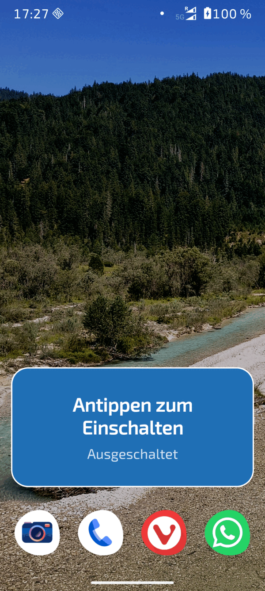
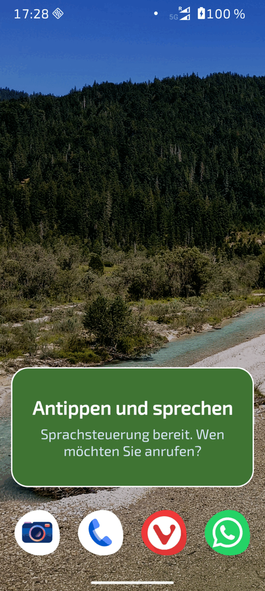

[Deutsch](README.md) | [English](README.en.md) | [Changelog](#changelog) | [TODO](TODO.en.md)


# DialOS Mobile

The phone companion to [DialOS](https://github.com/Stephan-Lefty/DialOS):
an Android app that lets you **place calls using nothing but your voice**.
Built for blind people and people with severe motor impairments who cannot
operate a phone by touch – but who want to call and be called.

Recognition runs **entirely offline** on the device, using the same engine
as the DialOS desktop (Vosk). No audio ever leaves the phone, and the app
works without an internet connection and without Google services.

The spoken interface is German, because the offline model is a German one.

This project was created together with [Claude](https://claude.com).

## Screenshots

Click to enlarge.

<table>
<tr>
<td align="center" width="25%">
<a href="screenshots/01_startseite_aus.png"></a><br>
<sub>Off</sub>
</td>
<td align="center" width="25%">
<a href="screenshots/02_startseite_hoert_zu.png"></a><br>
<sub>Mid-dialogue</sub>
</td>
<td align="center" width="25%">
<a href="screenshots/03_infos_einstellungen.png"></a><br>
<sub>Settings</sub>
</td>
<td align="center" width="25%">
<a href="screenshots/04_kontrastansicht.png"></a><br>
<sub>High contrast</sub>
</td>
</tr>
</table>

## The home screen widget

A bar spanning the full screen width – for this audience an app icon among
twenty others is not a usable target. One tap turns it on and immediately
asks „Wen möchten Sie anrufen?“ (who would you like to call?).

<table>
<tr>
<td align="center" width="50%">
<a href="screenshots/widget/05_widget_aus.png"></a><br>
<sub>Off</sub>
</td>
<td align="center" width="50%">
<a href="screenshots/widget/06_widget_an.png"></a><br>
<sub>On</sub>
</td>
</tr>
</table>

The state changes through **colour and text** – colour alone is not enough
if someone cannot distinguish colours well. Blind users hear a separate,
fuller description through TalkBack.

## What a call sounds like

```
User: „Sprachsteuerung starten“          (start voice control)
App:  „Sprachsteuerung bereit. Wen möchten Sie anrufen?“
User: „Max Mustermann anrufen“
App:  „Soll ich Max Mustermann auf Mobil anrufen?
       Sagen Sie Ja oder Nein.“
User: „Ja“
App:  „Ich rufe Max Mustermann an.“      → the call starts
```

Dictating a number instead of naming a contact:

```
User: „Nummer wählen“
App:  „Bitte sprechen Sie die Nummer, Ziffer für Ziffer.
       Sagen Sie fertig, wenn Sie durch sind.“
User: „null eins sieben neun …“
App:  „0 1 7 9 …“                        (reads back after every group)
User: „fertig“
App:  „Soll ich die Nummer 0 1 7 9 … anrufen?
       Sagen Sie Ja oder Nein.“
User: „Ja“
```

Available at any point: **„Abbrechen“** (cancel), **„Hilfe“** (help),
**„Wiederholen“** (repeat), **„Sprachsteuerung beenden“** (shut down).
After 15 seconds of silence the app ends the dialogue by itself and goes
back to waiting for the wake phrase.

## Features

- **Wake phrase „Sprachsteuerung starten“** – the app listens continuously
  in the background, no need to wake the screen.
- **Contact matching that forgives mishearing.** Three methods combined:
  token comparison (a surname on its own is enough), Levenshtein similarity
  (`Musterman` → `Mustermann`) and the **Cologne phonetic algorithm**, so
  `Meier`, `Maier`, `Mayer` and `Meyer` all resolve to the same contact.
- **Disambiguation:** with several plausible matches the app reads them out
  numbered and the user says „eins“, „zwei“ – or repeats the name.
- **Several numbers per contact:** mobile first, then home, then work.
  Saying „Nein“ moves to the next number instead of cancelling.
- **Dictating digits** in German, including compound numerals
  („einundzwanzig“ → `21`), `plus` for the country code and
  „doppel sieben“ for `77`.
- **Confirmation before dialling** (can be switched off) – a misrecognition
  should never turn into a wrong call.
- **Four ways to start the dialogue:** wake phrase, a large button in the
  app, a quick settings tile, or the assistant gesture (the app can be set
  as the default digital assistant).
- **Restarts automatically** after the phone reboots.
- **Accessible UI:** very large buttons, high contrast, status shown as a
  live region so TalkBack announces every change.
- **Contrast can be switched** (button top right): black background with
  yellow buttons for people with severe visual impairment.
- **Volume can be switched** (button top left): 50 % or full. The app always
  sets 50 % on startup – a phone turned down too far otherwise only becomes
  apparent when the app seems to go silent.

## How it is built

| Component | Responsibility |
|---|---|
| [`VoiceService`](app/src/main/java/org/dialos/mobil/VoiceService.kt) | Foreground service, keeps microphone and dialogue alive, dials via `TelecomManager` |
| [`VoiceEngine`](app/src/main/java/org/dialos/mobil/VoiceEngine.kt) | Vosk binding: unpack the model, listen, pause |
| [`DialogController`](app/src/main/java/org/dialos/mobil/DialogController.kt) | The conversation as a state machine – no Android dependency at its core |
| [`CommandParser`](app/src/main/java/org/dialos/mobil/CommandParser.kt) | Recognises the wake phrase and commands in the transcript |
| [`NameMatcher`](app/src/main/java/org/dialos/mobil/NameMatcher.kt) | Name comparison including Cologne phonetics |
| [`GermanNumbers`](app/src/main/java/org/dialos/mobil/GermanNumbers.kt) | German numerals → digits |
| [`ContactRepository`](app/src/main/java/org/dialos/mobil/ContactRepository.kt) | Reads and searches the address book |

Two design decisions that are not obvious:

- **Free vocabulary rather than a grammar for the wake phrase.** A grammar
  restricted to the wake phrase would use less power, but switching to
  command mode means releasing the microphone for a moment – exactly when
  the user is still speaking.
- **Dialling through `TelecomManager.placeCall` instead of `ACTION_CALL`.**
  Since Android 10 a background service may no longer start an activity;
  the telecom service accepts the call reliably.

While the app is speaking, recognition is paused – otherwise it hears its
own voice. During a call it pauses as well and watches the call: if none
materialises within twelve seconds, it says so out loud instead of
silently falling back.

## Building

Requirements: Android SDK (platform 36, build tools 36) and a JDK 17.

```bash
./gradlew assembleDebug
```

The German Vosk model (~46 MB) is deliberately **not** in the repository.
Gradle downloads it from [alphacephei.com](https://alphacephei.com/vosk/models)
on the first build and unpacks it into the assets. A different model can be
supplied:

```bash
./gradlew assembleDebug -PvoskModelZip=/path/to/model.zip
```

Tests (name matching, numerals, command parsing – no device needed):

```bash
./gradlew test
```

The resulting APK is at `app/build/outputs/apk/debug/app-debug.apk`, around
63 MB – mostly the speech model.

## Setting it up on the phone

1. Install the APK (allow installation from unknown sources).
2. Open the app and tap **„Berechtigungen erteilen“**: microphone,
   contacts, phone calls and notifications.
3. Tap **„Akku-Optimierung ausnehmen“** – otherwise the service is put to
   sleep after a while and stops hearing the wake phrase.
4. Tap **„Sprachsteuerung einschalten“**. The app confirms out loud.

**On Xiaomi devices step 3 is not enough.** MIUI terminates background
services independently of battery optimisation; what matters there is the
**„Hintergrund-Autostart“** (background autostart) list, which is set to
"not allowed" for almost every app out of the box. Details in
[docs/xiaomi-einstellungen.md](docs/xiaomi-einstellungen.md) – read off an
actual device, not guessed.

Optional but worthwhile for the target audience:

- Under *Apps → Default apps → Digital assistant*, select **DialOS Mobil**.
  The assistant gesture then starts the dialogue directly.
- Add the **„Sprachsteuerung“** tile to the quick settings.

## Known limits

- **Autostart on Android 14 and newer:** a service with microphone access
  may not be started from the background. After a reboot the app therefore
  posts a tappable notification instead of listening straight away.
- **Continuous listening costs battery.** With battery optimisation
  disabled, expect a noticeable increase; the small Vosk model was chosen
  deliberately to limit this.
- **The small German model** (`vosk-model-small-de-0.15`) is built for
  commands, not dictation. Unusual proper names are recognised less well –
  the name matcher compensates for a good part of that.
- **This app is not an emergency call feature.** An emergency call should
  never depend on speech recognition.

## Credits

- [Vosk](https://alphacephei.com/vosk/) by Alpha Cephei – offline
  recognition and the German model (Apache License 2.0).
- Logo and colours from the [DialOS](https://github.com/Stephan-Lefty/DialOS) project.

## Licence

[Apache License 2.0](LICENSE) – Copyright 2026 Stephan Rösner.

The same licence as Vosk, the German speech model and the Android
libraries in use; chosen deliberately so that a single licence covers the
whole stack and the included patent grant applies. Anyone redistributing
the app must ship the [NOTICE](NOTICE) file – it names the authors of the
bundled components.

## Changelog

### 0.6.9 (2026-09-09)

The widget button from 0.6.8 works – but nobody could find it. That was not
the button's fault.

- **The settings page threw you out while you were reading.** It closed
  itself after **ten seconds** of inactivity; intended for someone who
  strays there by accident and cannot find their way back unaided. But the
  timer was only extended by **touches**. Anyone having the page read out by
  TalkBack touches nothing – and was thrown back mid-sentence. The settings
  were therefore unusable for precisely the users this app is built for.
  It is now 60 seconds, and **with a screen reader active the automatic
  return does not apply at all**.

Noticed because Stephan could not find the new widget button – and I needed
three attempts myself, with a cable and knowing where to look.

Verified on the device: the page is still open after 29 seconds. And the
widget button from 0.6.8 does what it should – the launcher shows its
confirmation dialogue with a preview, tapping "Add" places the bar, and
afterwards the button disappears.

### 0.6.9 (2026-09-10)

Two findings from the closed test, and the second is the same bug as in
0.6.3 – just somewhere else.

- **Contact selection was hiding matches.** It cut off silently after the
  third suggestion. Anyone with five contacts called Hans could not reach
  two of them by voice and was never told they existed. It now offers up to
  six – the limit of what anyone can hold in mind while listening – and if
  there are more, **the app says so**: "I found eight and will read out the
  first six." Along with the way out: give both first and last name.
- **"Abbrechen" led into a dead end.** The app said "Abgebrochen." and fell
  silent. After that it listens only for the wake phrase – but it did not
  say so. Anyone who then said a name was talking to nobody; one tester
  concluded speech recognition was broken. It never was.
  Two things changed: the announcement now names the way back (and
  distinguishes whether the wake phrase is enabled at all). And
  **"Abbrechen" now ends only the current step**, not the whole
  conversation: cancelling in the middle of a contact selection asks "Wen
  möchten Sie anrufen?" instead of throwing you out. To end the conversation
  entirely, "Sprachsteuerung beenden" still works.

Both are the same pattern as twice before: the technology did not fail – the
app failed to say what it expected.

### 0.6.8 (2026-09-09)

- **The app now offers to place the widget itself.** The usual route is
  practically unusable for this audience: press and hold an empty area,
  scroll a list, find the right entry, drag it and drop it in the right
  place. Anyone who cannot see, or whose hands are unsteady, fails at that –
  and would end up without the very aid built for them.
  "Info & settings" now has a button that asks the launcher to do it
  (`requestPinAppWidget`), which then shows nothing more than a confirmation
  dialogue. The button appears **only** when the bar is not yet placed and
  the launcher supports the request – otherwise it would be clutter or a
  disappointment. If the launcher cannot do it after all, a note explains
  the manual route.

### 0.6.7 (2026-09-09)

The first release verified on an actual device rather than merely built.
Both findings surfaced *because* the phone was plugged in – neither would
have shown up at the desk.

- **The widget text was wrong.** In the running state it read "Jetzt
  sprechen" (speak now) – but you cannot simply start speaking; you first
  have to say the wake phrase or tap. The line beneath it even contradicted
  it. It now shows a call to action: "Antippen zum Einschalten" (tap to turn
  on) and "Antippen und sprechen" (tap and speak).
  For blind users TalkBack reads a separate, fuller description anyway; the
  visible text is for people with residual vision. Both now say the same
  thing.
- **The interruption counter was counting app updates.** An `install -r`
  triggered an "interruption" because the service really is stopped and
  restarted. Technically correct, practically useless: the counter exists to
  answer whether the *device* is killing the app. Restarts after an update or
  a reboot no longer count.

Verified on the device (Motorola edge 50 neo, Android 16): the widget spans
the full screen width, switches colour and text reliably, a tap starts the
dialogue (not just the app), and TalkBack reads the correct description.
Interruption detection was triggered with `adb shell am force-stop` and
correctly classified the case as `AFTER_INTERRUPTION`.

### 0.6.6 (2026-09-09)

- **The home screen no longer trusts its own memory.** When Android tears
  down only the service and leaves the process standing – Xiaomi devices in
  particular do this – `onDestroy` does not reliably run, and the remembered
  state stays on "running". The large button therefore still read "turn
  voice control off" although nothing was running: pressing it did the
  opposite of what it said.
  On opening the app the state is now queried from the system instead of
  read from memory, and a notice says that the phone stopped voice control.
  Reported by a tester on a Xiaomi Redmi 13C who already had battery
  optimisation disabled.

### 0.6.5 (2026-09-07)

- **The app now says when Android has killed it.** A tester reported that
  the app kept shutting itself down. Whether that was true could not be
  established: a foreground service terminated by the system is **not a
  crash** and therefore appears in no statistic at all – not even in Android
  Vitals. And the app itself simply fell silent. Someone who cannot see the
  screen only notices when they want to make a call and nothing happens.
  It now detects the case
  ([`InterruptionDetector`](app/src/main/java/org/dialos/mobil/StartCause.kt))
  and announces on the next start that it was interrupted, along with a hint
  about battery optimisation. The distinction is made via the phone's uptime:
  if it runs backwards, there was a reboot in between, and that is not an
  interruption. "Info & settings" additionally shows **how often** it
  happened and when last. That answers the question without a cable, without
  a log and without the Play Console.
- **Home screen widget**, spanning the full width. An app icon among twenty
  others is not a usable target for this audience; a bar across the whole
  screen is. It also shows whether voice control is running – previously
  only visible in the notification shade. One tap turns it on and asks "Wen
  möchten Sie anrufen?" straight away, rather than merely opening the app.
  State changes use colour **and** text, because colour alone is not enough.

### 0.6.4 (2026-09-06)

Dictating phone numbers was unusable, and not because of the recogniser. One
test report exposed four things at once.

- **The app deafened itself while you dictated.** After every recognised
  block of digits it read back the *entire number so far* &#8211; and while
  it speaks, the microphone is off. Anyone dictating fluently spoke straight
  into that gap, and those digits were lost. The longer the number, the
  longer the announcement, the bigger the gap. That happened twice during the
  test, one digit each time. The app now confirms only the **newly added**
  digits.
- **A half-dictated number is no longer lost to a timeout.** The wait was a
  flat 15 seconds &#8211; including while dictating, where you may first have
  to look a number up or read it off a note. When it expired, the app called
  `goIdle()` and silently discarded **every** digit. Dictation now allows 45
  seconds, and if digits are present when it expires, the app asks about them
  instead of throwing them away.
- **After dictating, the app now says what to do.** It used to read the
  digits back and then fall silent. The hint about “fertig” came once at the
  very start &#8211; and, as the report put it, was long forgotten by the
  time dictation was over. The instruction is therefore repeated after the
  first block of digits, and not after that, so it does not get in the way.
- **Single digits can be taken back.** “Letzte Ziffer löschen”, “eine zurück”
  or “rückgängig” removes exactly one. Previously there was only “löschen”
  &#8211; so a single swallowed digit meant respeaking an eleven-digit number
  from scratch.

The spoken help text and the instructions under “Info &amp; settings” know
the new commands too.

### 0.6.3 (2026-09-05)

The first release driven by feedback from the closed test. Two testers
independently reported problems on the same day that turned out to be
plainly provable in the code.

- **"Ja bitte" and "nein danke" are understood.** Command words were matched
  against the *whole* sentence rather than word by word, so the most common
  form of answer failed – even though "ja" and "bitte" were both in the list
  individually. This affected every user, not just the one who reported it.
- **Similar-sounding names no longer crowd out the intended one.** "Michelle
  anrufen" stubbornly suggested Michaels. Michelle, Michel and Michael share
  the same Cologne phonetic code (645) and therefore scored identically; on
  a tie the alphabetical order decided, and the three suggestion slots were
  taken by Michaels. A pure sound-alike match now scores lower than a real
  one ([`NameMatcher.PHONETIC_MAX`](app/src/main/java/org/dialos/mobil/NameMatcher.kt)).
  Meier/Maier/Mayer/Meyer are still found.
- **Number types in the command:** "Michaela privat anrufen" now dials the
  private number, and "privat", "mobil" or "Arbeit" is enough as an answer
  to the confirmation. Previously "privat" ended up inside the name and
  disturbed the search, and as an answer it was not understood – anyone with
  two numbers stored could only reach the second by repeatedly saying no.
- **Dead end after "Das habe ich nicht verstanden" removed.** The app was
  meant to repeat the question afterwards but repeated the notice instead:
  the field holding the last question was overwritten by the notice itself.
- **The timeout announcement now tells the truth.** It used to say "Ich
  beende die Sprachsteuerung" although the app merely returned to listening
  for the wake phrase. Someone who cannot see the screen would switch it
  back on unnecessarily.
- **Voice and speech rate are configurable** (Info & settings). Four speed
  steps from slow to very fast, plus whichever German voices the device
  offers. Both as step-forward buttons rather than sliders, and **each tap
  plays a sample** – there is no other way to judge a voice without sight.

Not fixed: **the app does not understand Swiss German.** The Vosk model is
trained on standard German; no Swiss model of this size exists. That is a
limit, not a pending fix.

### 0.6.2 (2026-08-20)

- **Telephony is now required** (`uses-feature … required="true"`). Google
  Play therefore only offers the app to devices with telephony. Previously
  it could have been installed on a Wi-Fi tablet, would listen, recognise
  the name – and then fail silently when dialling. Exactly the failure mode
  that is worst for a blind user. Side effect: no tablet screenshots are
  needed for the store.
- **Internal test release published in the Play Console** (versionCode 8,
  49.9 MB download).
- **Recruiting testers on dialos.org**, new folder
  [`website/`](website/README.md): scripts that create both posts –
  [German](https://dialos.org/dialos-mobil-tester-gesucht/) and
  [English](https://dialos.org/dialos-mobil-testers-wanted/) – along with
  the sign-up form through the WordPress REST API, plus a small plugin for
  the comment sections. Everything is re-runnable, so that text changes
  happen in the repository rather than in the WordPress editor.


### 0.6.1 (2026-08-19)

**The first complete call by voice worked** – from „Sprachsteuerung
starten" through to a connected call. Two defects had been in the way:

- **Phone numbers are normalised before dialling.** Address books often
  store them as „+49 176 1234-5678"; the spaces make the `tel:` URI
  invalid, and the telecom service discards it **silently**, without
  throwing. That is exactly why the log showed nothing: no error, no call.
- **The call watcher cleaned up before the call existed.** It checked two
  seconds after dialling whether the audio mode was normal and concluded
  „call ended". A call needs several seconds to start ringing. There is now
  a 12-second grace period – and if nothing materialises, **the app says so
  out loud** instead of silently dropping back to idle.

**The confirmations now sound like questions.** In testing Stephan waited
7 and 10 seconds respectively because „Carola Stern, Mobil, anrufen?" did
not prompt him to answer – both delays are in the log. Android TTS does not
reliably produce a rising intonation, so the instruction is now part of the
sentence: „Soll ich … anrufen? **Sagen Sie Ja oder Nein.**"

*Which of the two fixes actually unblocked the call is open: both went in
together, and the successful test ran with the cable disconnected. The
number is the likelier candidate, because the watcher would not have
prevented the call, only reset the dialogue.*

- Also: phone numbers now appear only partially in the log (`017…78`),
  no longer in clear text.


### 0.6.0 (2026-08-19)

- **Text messages removed again.** Not for technical reasons – the path
  worked – but for publication: Google only grants the `SEND_SMS`
  permission for a closed list of approved use cases, and a voice dialler
  is not on it. The app would most likely have failed review. Calling
  remains the core function, and its chances there are good.
- The app therefore no longer requests any SMS permission.
- Play Store preparation: release signing, app bundle, privacy policy,
  store texts, data safety guidance and a
  [step-by-step guide](docs/veroeffentlichung.md) (German).
- Verified against the built package: the app has **no internet
  permission** – it is technically unable to send anything.


### 0.5.0 (2026-08-19)

- **Choosing the SIM by voice on dual SIM/eSIM devices.** After the
  confirmation the app asks „Über welche Karte? Eins: 1&1. Zwei: YELLLOW.“ –
  answer with the number or the carrier name. The name announced is the one
  from the Android settings, not the network operator – while roaming the
  card would otherwise be called „3 AT – 1&1“. Applies to calls and messages
  alike. With only one card, no question is asked.
- Without that choice Android silently uses the default card – possibly the
  wrong one, and abroad the expensive one.
- „Infos & Einstellungen“ now shows the version and a link to the source
  code on GitHub.
- The logo on the start screen is twice the size; the start screen scrolls
  in exchange, so nothing is cut off on small devices.


### 0.4.0 (2026-08-19)

- **Start screen reduced to the essentials:** volume, contrast, status and a
  single button of twice the height. Everything about setup now sits behind
  „Infos & Einstellungen“ at the bottom centre.
- **The button now starts the dialogue straight away.** Previously you had
  to say „Sprachsteuerung starten“ after switching on – redundant when the
  phone is already in your hand. The wake phrase still matters later (phone
  in a pocket, screen off).
- „Infos & Einstellungen“ has a large **Back button** at the top and bottom
  and returns to the start screen by itself after 10 seconds without a
  touch – someone who lands there by accident may not find their way back.
- Fixed: `fitsSystemWindows` overwrites the padding of the view it sits on –
  the buttons were stuck to the screen edges because of it.

### 0.3.0 (2026-08-19)

- **Contrast toggle** top right: black background, yellow buttons. Yellow
  on black stays legible under glare and contrast loss, where blue on white
  blurs.
- **Volume toggle** top left, 50 % or 100 %. The app sets 50 % on every
  start – the test device sat at 27 %, and someone who cannot see only
  notices too quiet an announcement when the app appears to go silent.
  Speech output now uses the media stream, the same one the phone's volume
  keys control.
- The **„Jetzt sprechen“ button was removed**: it was redundant. With voice
  control off it does not help; with it on, the wake phrase is enough. The
  quick settings tile, launcher shortcut and assistant intent remain for a
  manual start.
- The „Permissions“ and „Continuous operation“ sections are styled more
  quietly – they are needed once, not daily.

### 0.2.0 (2026-08-19)

- **Text messages by voice**: „Schreibe Max Mustermann“, dictate the text,
  finish with „fertig“. The app reads recipient and text back and only
  sends after „Ja“.
- The confirmation before sending is deliberately not switchable – unlike a
  call, an SMS is irreversible and costs money.
- Mobile numbers are preferred for messages; if only a landline is left,
  the app says so out loud.
- New voice commands: „Löschen“ / „noch mal von vorn“ discards the dictated
  text. Dictation allows a longer pause (30 instead of 15 seconds).
- The SIM card comes from the Android default for SMS – on dual-SIM devices
  the one already configured there is used.
- First run on real hardware passed (Motorola edge 50 neo, Android 16).
- Material You colours removed and all colour roles set explicitly: the
  DialOS blue had been replaced by tones derived from the wallpaper,
  leaving contrast to chance.

### 0.1.0 (2026-08-19)

- First version.
- Wake phrase „Sprachsteuerung starten“ via continuously running offline
  recognition (Vosk, German model).
- Calling contacts by name using Cologne phonetics, Levenshtein similarity
  and token comparison; disambiguation prompt for ambiguous matches.
- Dictating phone numbers by voice, including German numerals, country
  code via „plus“ and „doppel“ for repeated digits.
- Confirmation before dialling, can be switched off.
- Additional entry points: button, quick settings tile, launcher shortcut
  and assistant intent.
- Autostart after reboot with a fallback notification on Android 14+.
- Accessible UI with very large buttons and a live region for TalkBack.
- Logo and colour scheme taken from DialOS.
- The model is fetched at build time and is not stored in the repository.
