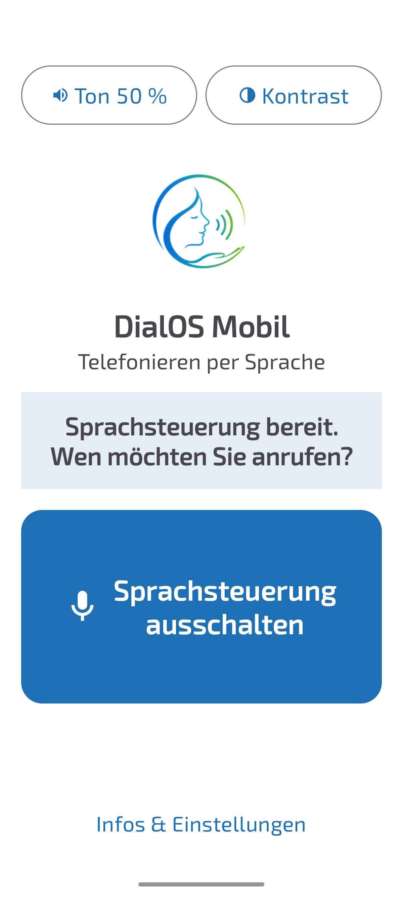
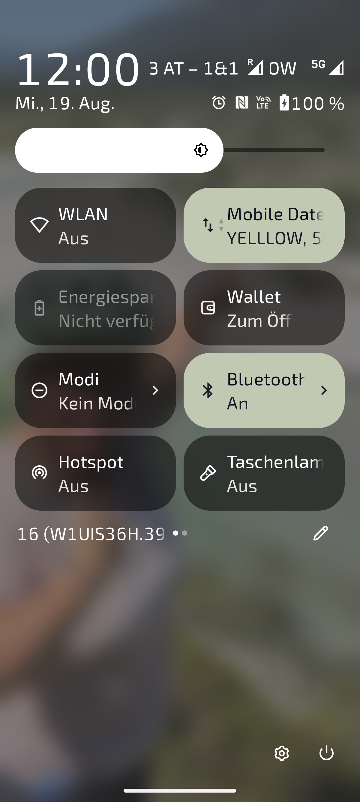

[Deutsch](README.md) | [English](README.en.md) | [Änderungsprotokoll](#änderungsprotokoll) | [TODO](TODO.md)


# DialOS Mobil

Der Handy-Ableger von [DialOS](https://github.com/Stephan-Lefty/DialOS):
eine Android-App, mit der man **allein durch Sprechen telefonieren** kann.
Gedacht für blinde und motorisch stark eingeschränkte Menschen, die ein
Telefon nicht bedienen können – aber angerufen werden wollen und selbst
anrufen möchten.

Die Erkennung läuft **vollständig offline** auf dem Gerät, mit derselben
Engine wie der DialOS-Desktop (Vosk). Es verlässt kein Ton das Telefon,
und die App funktioniert ohne Internet und ohne Google-Dienste.

Dieses Projekt ist in Zusammenarbeit mit [Claude](https://claude.com) entstanden.

## Bildschirmfotos

Zum Vergrößern anklicken.

<table>
<tr>
<td align="center" width="25%">
<a href="screenshots/01_startseite_aus.png"></a><br>
<sub>Ausgeschaltet</sub>
</td>
<td align="center" width="25%">
<a href="screenshots/02_startseite_hoert_zu.png"></a><br>
<sub>Im Gespräch</sub>
</td>
<td align="center" width="25%">
<a href="screenshots/03_infos_einstellungen.png"></a><br>
<sub>Einstellungen</sub>
</td>
<td align="center" width="25%">
<a href="screenshots/04_kontrastansicht.png"></a><br>
<sub>Hoher Kontrast</sub>
</td>
</tr>
</table>

## So läuft ein Anruf ab

```
Nutzer:  „Sprachsteuerung starten“
App:     „Sprachsteuerung bereit. Wen möchten Sie anrufen?“
Nutzer:  „Max Mustermann anrufen“
App:     „Soll ich Max Mustermann auf Mobil anrufen?
          Sagen Sie Ja oder Nein.“
Nutzer:  „Ja“
App:     „Ich rufe Max Mustermann an.“   → der Anruf startet
```

Eine Nummer diktieren statt einen Kontakt zu nennen:

```
Nutzer:  „Nummer wählen“
App:     „Bitte sprechen Sie die Nummer, Ziffer für Ziffer.
          Sagen Sie fertig, wenn Sie durch sind.“
Nutzer:  „null eins sieben neun …“
App:     „0 1 7 9 …“                     (liest nach jeder Gruppe zurück)
Nutzer:  „fertig“
App:     „Soll ich die Nummer 0 1 7 9 … anrufen?
          Sagen Sie Ja oder Nein.“
Nutzer:  „Ja“
```

Jederzeit möglich: **„Abbrechen“**, **„Hilfe“**, **„Wiederholen“**,
**„Sprachsteuerung beenden“**. Bleibt es 15 Sekunden still, beendet die
App den Dialog von selbst und wartet wieder auf das Aktivierungswort.

## Funktionen

- **Aktivierungswort „Sprachsteuerung starten“** – die App hört dauerhaft
  im Hintergrund mit, ohne dass der Bildschirm an sein muss.
- **Kontaktsuche, die Verhörer verzeiht.** Drei Verfahren greifen
  ineinander: wortweiser Vergleich (Nachname allein genügt),
  Levenshtein-Ähnlichkeit (`Musterman` → `Mustermann`) und
  **Kölner Phonetik** – damit finden `Meier`, `Maier`, `Mayer` und `Meyer`
  denselben Kontakt.
- **Rückfrage bei mehreren Treffern:** Die App liest die Vorschläge
  nummeriert vor, der Nutzer sagt „eins“, „zwei“ oder den Namen noch einmal.
- **Mehrere Nummern pro Kontakt:** Mobil zuerst, dann Privat, dann Arbeit.
  Ein „Nein“ springt zum nächsten Vorschlag statt abzubrechen.
- **Ziffern diktieren** in deutscher Sprache, auch zusammengesetzt
  („einundzwanzig“ → `21`), mit `plus` für die Ländervorwahl und
  „doppel sieben“ für `77`.
- **Bestätigung vor dem Wählen** (abschaltbar) – eine Fehlerkennung soll
  keinen Fehlanruf auslösen.
- **Vier Wege, das Gespräch zu starten:** Aktivierungswort, große
  Schaltfläche in der App, Kachel in den Schnelleinstellungen, oder die
  Assistenten-Geste (die App lässt sich als Standard-Assistent setzen).
- **Autostart nach dem Neustart** des Telefons.
- **Barrierefreie Oberfläche:** sehr große Schaltflächen, hoher Kontrast,
  Statusanzeige als Live-Region – TalkBack liest jede Änderung mit vor.
- **Kontrast umschaltbar** (Knopf oben rechts): schwarzer Grund mit gelben
  Schaltflächen für Menschen mit starker Sehbehinderung.
- **Lautstärke umschaltbar** (Knopf oben links): 50 % oder volle Lautstärke.
  Beim Start der App werden immer 50 % gesetzt – ein zu leise gedrehtes
  Telefon fällt sonst erst auf, wenn die App scheinbar schweigt.

## Technischer Aufbau

| Baustein | Aufgabe |
|---|---|
| [`VoiceService`](app/src/main/java/org/dialos/mobil/VoiceService.kt) | Vordergrunddienst, hält Mikrofon und Dialog am Leben, wählt über `TelecomManager` |
| [`VoiceEngine`](app/src/main/java/org/dialos/mobil/VoiceEngine.kt) | Vosk-Anbindung: Modell entpacken, zuhören, pausieren |
| [`DialogController`](app/src/main/java/org/dialos/mobil/DialogController.kt) | Der Gesprächsablauf als Zustandsautomat – ohne Android-Abhängigkeiten im Kern |
| [`CommandParser`](app/src/main/java/org/dialos/mobil/CommandParser.kt) | Erkennt Aktivierungswort und Befehle im erkannten Text |
| [`NameMatcher`](app/src/main/java/org/dialos/mobil/NameMatcher.kt) | Namensvergleich inkl. Kölner Phonetik |
| [`GermanNumbers`](app/src/main/java/org/dialos/mobil/GermanNumbers.kt) | Deutsche Zahlwörter → Ziffern |
| [`ContactRepository`](app/src/main/java/org/dialos/mobil/ContactRepository.kt) | Adressbuch lesen und durchsuchen |

Zwei Entwurfsentscheidungen, die nicht offensichtlich sind:

- **Freier Wortschatz statt Grammatik für das Aktivierungswort.** Eine auf
  den Wake-Satz beschränkte Grammatik wäre sparsamer, verlangt beim
  Umschalten in den Befehlsmodus aber, das Mikrofon kurz freizugeben –
  genau in dem Moment, in dem der Nutzer weiterspricht.
- **Wählen über `TelecomManager.placeCall` statt `ACTION_CALL`.** Seit
  Android 10 darf ein Hintergrunddienst keine Activity mehr starten; der
  Telecom-Dienst nimmt den Anruf dagegen zuverlässig entgegen.

Während die App selbst spricht, wird die Erkennung angehalten – sonst
hört sie ihre eigene Stimme. Läuft ein Gespräch, pausiert sie ebenfalls
und beobachtet den Anruf: kommt binnen zwölf Sekunden kein Gespräch
zustande, sagt sie das ausdrücklich, statt stumm zurückzufallen.

## Bauen

Voraussetzungen: Android SDK (Plattform 36, Build-Tools 36) und ein JDK 17.

```bash
./gradlew assembleDebug
```

Das deutsche Vosk-Modell (~46 MB) liegt bewusst **nicht** im Repo –
Gradle lädt es beim ersten Build automatisch von
[alphacephei.com](https://alphacephei.com/vosk/models) herunter und
entpackt es in die Assets. Ein eigenes Modell lässt sich mitgeben:

```bash
./gradlew assembleDebug -PvoskModelZip=/pfad/zum/modell.zip
```

Tests (Namensvergleich, Zahlwörter, Befehlserkennung – ohne Gerät lauffähig):

```bash
./gradlew test
```

Das fertige APK liegt unter `app/build/outputs/apk/debug/app-debug.apk`
und ist rund 62 MB groß – das Sprachmodell macht den Großteil aus.

## Einrichtung auf dem Telefon

1. APK installieren (Installation aus unbekannten Quellen erlauben).
2. App öffnen, **„Berechtigungen erteilen“** antippen: Mikrofon, Kontakte,
   Telefonieren und Benachrichtigungen.
3. **„Akku-Optimierung ausnehmen“** antippen – sonst schläft der Dienst
   nach einiger Zeit ein und hört das Aktivierungswort nicht mehr.
4. **„Sprachsteuerung einschalten“**. Die App bestätigt gesprochen.

Optional, aber für die Zielgruppe sinnvoll:

- In den Android-Einstellungen unter *Apps → Standard-Apps → Digitaler
  Assistent* **DialOS Mobil** auswählen. Dann startet die Assistenten-Geste
  direkt das Gespräch.
- Die Kachel **„Sprachsteuerung“** in die Schnelleinstellungen ziehen.

## Bekannte Grenzen

- **Autostart ab Android 14:** Ein Dienst mit Mikrofon-Zugriff darf nicht
  aus dem Hintergrund gestartet werden. Nach einem Neustart legt die App
  deshalb eine antippbare Benachrichtigung an, statt sofort loszuhören.
- **Dauerhaftes Zuhören kostet Akku.** Auf einem Testgerät mit
  ausgenommener Akku-Optimierung ist mit spürbarem Mehrverbrauch zu
  rechnen; das kleine Vosk-Modell ist bewusst gewählt, um das zu begrenzen.
- **Das kleine deutsche Modell** (`vosk-model-small-de-0.15`) ist auf
  Kommandos ausgelegt, nicht auf Diktat. Ungewöhnliche Eigennamen erkennt
  es entsprechend schlechter – dafür gleicht der Namensvergleich einiges aus.
- **Die App ersetzt keine Notruffunktion.** Ein Notruf sollte niemals von
  einer Spracherkennung abhängen.

## Danksagung

- [Vosk](https://alphacephei.com/vosk/) von Alpha Cephei – Offline-Erkennung
  und deutsches Sprachmodell (Apache-Lizenz 2.0).
- Logo und Farben aus dem [DialOS](https://github.com/Stephan-Lefty/DialOS)-Projekt.

## Lizenz

[Apache-Lizenz 2.0](LICENSE) – Copyright 2026 Stephan Rösner.

Dieselbe Lizenz wie Vosk, das deutsche Sprachmodell und die verwendeten
Android-Bibliotheken; bewusst so gewählt, damit über den ganzen Aufbau
hinweg eine einzige Lizenz gilt und die enthaltene Patenterteilung greift.
Wer die App weitergibt, muss die [NOTICE](NOTICE)-Datei mitliefern – dort
stehen die Urheber der mitgelieferten Bestandteile.

## Änderungsprotokoll

### 0.6.5 (2026-09-07)

- **Die App sagt jetzt, wenn Android sie abgeräumt hat.** Aus dem Test kam
  die Meldung, die App beende sich immer wieder selbst. Ob das stimmt, war
  nicht zu klären: Ein vom System beendeter Vordergrunddienst ist **kein
  Absturz** und taucht deshalb in keiner Statistik auf – auch nicht in
  Android Vitals. Und die App selbst verstummte einfach. Wer nicht auf den
  Bildschirm sehen kann, merkt das erst, wenn er telefonieren will und
  nichts passiert.
  Jetzt erkennt sie den Fall
  ([`InterruptionDetector`](app/src/main/java/org/dialos/mobil/StartCause.kt))
  und sagt beim nächsten Start an, dass sie unterbrochen war – samt Hinweis
  auf die Akku-Optimierung. Unterschieden wird über die Betriebszeit des
  Telefons: Läuft sie rückwärts, war ein Neustart dazwischen, und das ist
  keine Unterbrechung. In „Infos & Einstellungen" steht außerdem, **wie oft**
  es passiert ist und wann zuletzt. Damit lässt sich die Frage ohne Kabel,
  ohne Protokoll und ohne Play Console beantworten.
- **Widget für den Startbildschirm**, über die volle Breite. Ein App-Symbol
  zwischen zwanzig anderen ist für die Zielgruppe kein brauchbares Ziel; ein
  Balken über den ganzen Bildschirm schon. Er zeigt zugleich, ob die
  Sprachsteuerung läuft – das war bisher nur in der Benachrichtigungsleiste
  zu sehen. Ein Tippen schaltet ein und fragt sofort „Wen möchten Sie
  anrufen?", statt nur die App zu öffnen. Zustandswechsel: Farbe **und**
  Text, weil Farbe allein nicht reicht.

### 0.6.4 (2026-09-06)

Das Diktieren von Rufnummern war unbrauchbar, und das lag nicht an der
Erkennung. Ein Testbericht hat vier Dinge auf einmal aufgedeckt.

- **Die App machte sich beim Diktieren selbst taub.** Nach jedem erkannten
  Ziffernblock las sie die *gesamte bisherige Nummer* vor &#8211; und
  während sie spricht, ist das Mikrofon abgeschaltet. Wer flüssig
  weiterdiktierte, sprach genau in dieses Loch hinein, und diese Ziffern
  waren weg. Je länger die Nummer, desto länger die Ansage, desto größer das
  Loch. Genau das ist im Test zweimal passiert, je eine Ziffer. Die App
  bestätigt jetzt nur noch die **neu hinzugekommenen** Ziffern.
- **Eine halb diktierte Nummer geht nicht mehr durch Zeitablauf verloren.**
  Die Wartezeit lag pauschal bei 15 Sekunden &#8211; auch beim Diktieren,
  wo man eine Nummer erst nachschlagen oder ablesen muss. Lief sie ab, rief
  die App `goIdle()` und verwarf damit **alle** Ziffern kommentarlos. Jetzt
  sind es beim Diktieren 45 Sekunden, und wenn dann noch Ziffern
  dastehen, fragt die App nach, statt sie wegzuwerfen.
- **Nach dem Diktieren steht jetzt da, was zu tun ist.** Bisher las die App
  die Ziffern vor und schwieg. Der Hinweis auf „fertig“ kam einmal ganz am
  Anfang &#8211; und war, wie der Bericht wörtlich sagte, bis nach dem
  Diktieren längst vergessen. Die Anleitung steht deshalb nach dem ersten
  Ziffernblock noch einmal, danach nicht mehr, damit sie nicht im Weg ist.
- **Einzelne Ziffern lassen sich zurücknehmen.** „Letzte Ziffer löschen“,
  „eine zurück“ oder „rückgängig“ nimmt genau eine Stelle weg. Bisher gab es
  nur „löschen“ &#8211; und damit war eine elfstellige Nummer wegen einer
  einzigen verschluckten Ziffer komplett neu zu sprechen.

Der gesprochene Hilfetext und die Anleitung unter „Infos & Einstellungen“
kennen die neuen Befehle ebenfalls.

### 0.6.3 (2026-09-05)

Die erste Fassung, die auf Rückmeldungen aus dem geschlossenen Test beruht.
Zwei Tester meldeten am selben Tag voneinander unabhängig Dinge, die im
Code eindeutig nachweisbar waren.

- **„Ja bitte" und „nein danke" werden verstanden.** Die Befehlswörter wurden
  gegen den *ganzen* Satz verglichen, nicht Wort für Wort – deshalb fiel die
  häufigste Antwortform überhaupt durch, obwohl „ja" und „bitte" beide
  einzeln in der Liste standen. Das traf jeden Nutzer, nicht nur den, der es
  gemeldet hat.
- **Gleich klingende Namen verdrängen den gemeinten nicht mehr.** „Michelle
  anrufen" schlug hartnäckig Michaels vor. Michelle, Michel und Michael
  haben denselben Kölner Klangcode (645) und bekamen deshalb alle
  denselben Punktwert; bei Gleichstand entschied die alphabetische
  Reihenfolge, und die drei Vorschlagsplätze waren mit Michaels belegt. Ein
  reiner Klangtreffer wird jetzt niedriger bewertet als ein echter
  ([`NameMatcher.PHONETIC_MAX`](app/src/main/java/org/dialos/mobil/NameMatcher.kt)).
  Meier/Maier/Mayer/Meyer findet die App weiterhin.
- **Nummerntypen im Befehl:** „Michaela privat anrufen" wählt jetzt die
  private Nummer, und auf die Rückfrage genügt „privat", „mobil" oder
  „Arbeit". Bisher wanderte „privat" in den Namen und störte die Suche, und
  als Antwort war es unverständlich – wer zwei Nummern gespeichert hatte,
  kam an die zweite nur über mehrfaches „Nein".
- **Sackgasse nach „Das habe ich nicht verstanden" beseitigt.** Die App
  sollte danach die Frage wiederholen, sagte aber erneut den Hinweis: Die
  Hilfsvariable für die letzte Frage wurde vom Hinweis selbst überschrieben.
- **Die Ansage nach der Wartezeit sagt die Wahrheit.** Bisher hieß es „Ich
  beende die Sprachsteuerung", obwohl die App nur in den Lauschmodus
  zurückging und weiter auf das Aktivierungswort hörte. Wer nicht auf den
  Bildschirm sehen kann, schaltet sie daraufhin unnötig neu ein.
- **Stimme und Sprechtempo sind einstellbar** (Infos & Einstellungen). Vier
  Tempostufen von langsam bis sehr schnell, dazu die auf dem Gerät
  vorhandenen deutschen Stimmen. Beides über Knöpfe zum Weiterschalten statt
  über Schieberegler, und **nach jedem Tippen kommt eine Hörprobe** – anders
  lässt sich eine Stimme ohne Sicht nicht beurteilen.

Nicht behoben: **Schweizerdeutsch versteht die App nicht.** Das Vosk-Modell
ist auf Hochdeutsch trainiert; ein Schweizer Modell dieser Größe gibt es
nicht. Das ist eine Grenze, keine Fehlerbehebung in Sicht.

### 0.6.2 (2026-08-20)

- **Telefonie ist jetzt Pflicht** (`uses-feature … required="true"`). Google
  Play bietet die App damit nur noch Geräten mit Telefonie an. Vorher hätte
  sie sich auf einem WLAN-Tablet installieren lassen, zugehört, den Namen
  erkannt – und beim Wählen stumm versagt. Genau das Fehlerbild, das für
  einen blinden Nutzer am schlimmsten ist. Nebeneffekt: Für den Store
  braucht es keine Tablet-Screenshots.
- **Interner Testrelease in der Play Console veröffentlicht** (versionCode 8,
  49,9 MB Download).
- **Testersuche auf dialos.org**, neuer Ordner
  [`website/`](website/README.md): Skripte, die die beiden Beiträge
  [deutsch](https://dialos.org/dialos-mobil-tester-gesucht/) und
  [englisch](https://dialos.org/dialos-mobil-testers-wanted/) samt
  Anmeldeformular über die WordPress-Schnittstelle anlegen, dazu ein kleines
  Plugin für die Kommentarbereiche. Alles wiederholbar ausführbar, damit
  Textänderungen im Repo passieren und nicht im WordPress-Editor.


### 0.6.1 (2026-08-19)

**Der erste vollständige Anruf per Sprache hat funktioniert** – von
„Sprachsteuerung starten" bis zum aufgebauten Gespräch. Zwei Fehler
standen dem vorher im Weg:

- **Rufnummern werden vor dem Wählen aufbereitet.** Im Adressbuch stehen
  sie oft als „+49 176 1234-5678"; die Leerzeichen machen die
  `tel:`-Adresse ungültig, und der Telefonie-Dienst verwirft sie
  **stillschweigend**, ohne eine Ausnahme zu werfen. Genau deshalb war im
  Protokoll nichts zu sehen: kein Fehler, kein Anruf.
- **Der Anruf-Wächter räumte auf, bevor der Anruf entstand.** Er prüfte
  zwei Sekunden nach dem Wählen, ob der Audio-Modus normal ist, und
  schloss daraus „Gespräch beendet". Ein Anruf braucht aber mehrere
  Sekunden bis zum Klingeln. Jetzt gibt es 12 Sekunden Anlaufzeit – und
  kommt danach nichts zustande, **sagt die App das ausdrücklich**, statt
  stumm in den Wartezustand zurückzufallen.

**Die Rückfragen klingen jetzt wie Fragen.** Stephan wartete im Test
7 bzw. 10 Sekunden, weil „Carola Stern, Mobil, anrufen?" ihn nicht zu
einer Antwort veranlasste – beides steht so im Protokoll. Android-TTS
erzeugt keine verlässlich steigende Satzmelodie, deshalb steht die
Aufforderung jetzt im Satz: „Soll ich … anrufen? **Sagen Sie Ja oder
Nein.**" Die Kartenauswahl heißt „Für 1&1 sagen Sie 1" statt „1: 1&1" –
letzteres las die Stimme als Aufzählung vor, nicht als Angebot.

*Welche der beiden Korrekturen den Anruf tatsächlich freigemacht hat, ist
offen: Beide gingen zusammen ein, und der erfolgreiche Test lief ohne
angestecktes Kabel. Die Nummer ist der wahrscheinlichere Kandidat, weil
der Wächter den Anruf nicht verhindert, sondern nur den Dialog
zurückgesetzt hätte.*

- Nebenbei: Rufnummern erscheinen im Protokoll nur noch angedeutet
  (`017…78`), nicht mehr im Klartext.


### 0.6.0 (2026-08-19)

- **Kurznachrichten wieder entfernt.** Nicht aus technischen Gründen – der
  Weg funktionierte –, sondern für die Veröffentlichung: Google lässt die
  Berechtigung `SEND_SMS` nur für eine abschließende Liste zugelassener
  Anwendungsfälle zu, auf der ein Sprachwähler nicht steht. Die App hätte
  die Prüfung mit hoher Wahrscheinlichkeit nicht bestanden. Telefonieren
  bleibt die Kernfunktion, und dafür stehen die Chancen gut.
- Die App fordert damit **keine** SMS-Berechtigung mehr an.
- Vorbereitung für den Play Store: Release-Signierung, App-Bundle,
  Datenschutzerklärung, Store-Texte, Data-Safety-Ausfüllhilfe und eine
  [Schritt-für-Schritt-Anleitung](docs/veroeffentlichung.md).
- Nachgeprüft und im Paket belegt: Die App hat **keine
  Internetberechtigung** – sie kann technisch nichts versenden.


### 0.5.0 (2026-08-19)

- **Kartenwahl per Sprache bei zwei SIM/eSIM.** Nach der Bestätigung fragt
  die App „Über welche Karte? Eins: 1&1. Zwei: YELLLOW.“ – die Antwort geht
  per Zahl oder Anbietername. Angesagt wird der Name aus den
  Android-Einstellungen, nicht der Netzbetreiber – im Roaming hieße die
  Karte sonst „3 AT – 1&1“. Gilt für Anrufe wie für Nachrichten. Bei nur
  einer Karte wird nicht gefragt.
- Ohne diese Wahl nimmt Android stillschweigend die voreingestellte Karte –
  im Zweifel die falsche, im Ausland die teure.
- „Infos & Einstellungen“ zeigt jetzt die Version und einen Link zum
  Quelltext auf GitHub.
- Das Logo auf der Startseite ist doppelt so groß; der Startbildschirm
  lässt sich dafür scrollen, damit auf kleinen Geräten nichts abschneidet.


### 0.4.0 (2026-08-19)

- **Startbildschirm auf das Wesentliche reduziert:** Lautstärke, Kontrast,
  Zustand und ein einziger, doppelt so hoher Knopf. Alles zur Einrichtung
  liegt hinter „Infos & Einstellungen“ unten in der Mitte.
- **Der Knopf startet jetzt sofort das Gespräch.** Vorher musste man nach
  dem Einschalten noch „Sprachsteuerung starten“ sagen – doppelt, wenn man
  das Telefon ohnehin in der Hand hält. Das Aktivierungswort bleibt für
  später wichtig (Telefon in der Tasche, Bildschirm aus).
- „Infos & Einstellungen“ hat einen großen **Zurück-Knopf** oben und unten
  und springt nach 10 Sekunden ohne Berührung von selbst zur Startseite –
  wer versehentlich dort landet, findet sonst womöglich nicht zurück.
- Behoben: `fitsSystemWindows` überschreibt das Padding der View, auf der
  es steht – die Schaltflächen klebten dadurch am Bildschirmrand.

### 0.3.0 (2026-08-19)

- **Kontrast-Umschalter** oben rechts: schwarzer Grund, gelbe
  Schaltflächen. Gelb auf Schwarz bleibt bei Blendung und Kontrastverlust
  lesbar, wo Blau auf Weiß verschwimmt.
- **Lautstärke-Umschalter** oben links, 50 % oder 100 %. Die App setzt bei
  jedem Start 50 % – das Testgerät stand auf 27 %, und wer nichts sieht,
  bemerkt eine zu leise Ansage erst, wenn die App scheinbar schweigt.
  Die Sprachausgabe liegt dafür jetzt auf dem Medien-Kanal, den auch die
  Lautstärketasten des Telefons regeln.
- Die Schaltfläche **„Jetzt sprechen“ ist entfallen**: sie war redundant.
  Ist die Sprachsteuerung aus, hilft sie nicht; ist sie an, genügt das
  Aktivierungswort. Für den manuellen Start gibt es weiterhin die
  Schnelleinstellungs-Kachel, den Startsymbol-Kurzbefehl und den
  Assistenten-Aufruf.
- Die Abschnitte „Berechtigungen“ und „Dauerbetrieb“ sind zurückhaltender
  gestaltet – sie werden einmal gebraucht, nicht täglich.

### 0.2.0 (2026-08-19)

- **Kurznachrichten per Sprache**: „Schreibe Max Mustermann“, Text
  diktieren, mit „fertig“ abschließen. Die App liest Empfänger und Text
  noch einmal vor und sendet erst nach „Ja“.
- Bestätigung vor dem Absenden ist bewusst nicht abschaltbar – anders als
  beim Anruf ist eine SMS unwiderruflich und kostenpflichtig.
- Für Nachrichten werden Mobilnummern bevorzugt; bleibt nur eine
  Festnetznummer übrig, weist die App gesprochen darauf hin.
- Neue Sprachbefehle: „Löschen“ / „noch mal von vorn“ verwirft den
  diktierten Text. Beim Diktieren gilt eine längere Denkpause (30 statt
  15 Sekunden).
- Die SIM-Karte kommt aus der Android-Standardeinstellung für SMS – auf
  Geräten mit zwei Karten wird also die genommen, die dort ohnehin
  eingestellt ist.
- Erster Lauf auf echter Hardware bestanden (Motorola edge 50 neo,
  Android 16).
- Material-You-Farben entfernt und alle Farbrollen fest gesetzt: das
  DialOS-Blau war durch vom Hintergrundbild abgeleitete Töne ersetzt
  worden, der Kontrast hing damit vom Zufall ab.

### 0.1.0 (2026-08-19)

- Erste Fassung.
- Aktivierungswort „Sprachsteuerung starten“ über dauerhaft laufende
  Offline-Erkennung (Vosk, deutsches Modell).
- Anrufen per Kontaktname mit Kölner Phonetik, Levenshtein-Ähnlichkeit und
  wortweisem Vergleich; Rückfrage bei mehrdeutigen Treffern.
- Rufnummern per Sprache diktieren, inklusive deutscher Zahlwörter,
  Ländervorwahl mit „plus“ und „doppel“ für Wiederholungen.
- Bestätigung vor dem Wählen, abschaltbar.
- Start zusätzlich über Schaltfläche, Schnelleinstellungs-Kachel,
  Startsymbol-Kurzbefehl und Assistenten-Aufruf.
- Autostart nach Neustart mit Ausweich-Benachrichtigung ab Android 14.
- Barrierefreie Oberfläche mit sehr großen Schaltflächen und Live-Region
  für TalkBack.
- Logo und Farbschema aus DialOS übernommen.
- Modell wird beim Build automatisch geladen und liegt nicht im Repo.
